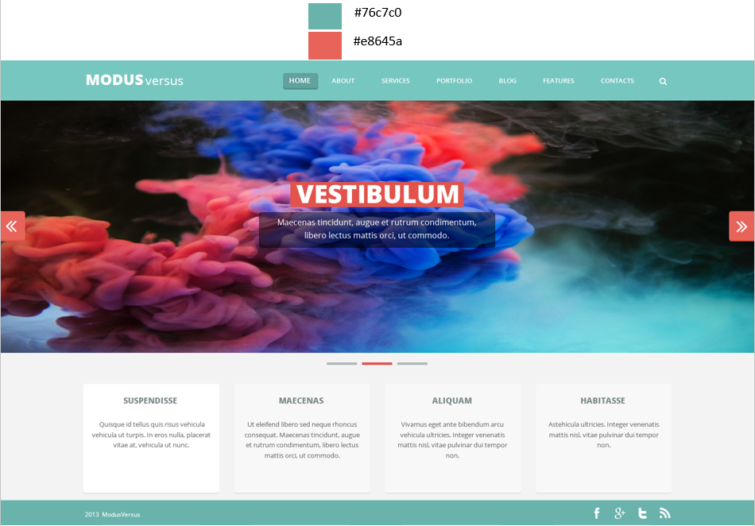

# Examen Final

- Crear una aplicación web que permita gestionar los servicios que ofrece una empresa, es decir la aplicación debe permitir a los usuarios crear, modificar, eliminar y consultar los servicios que la empresa ofrece. Los servicio únicamente tienen un `titulo` y `descripción` como atributos.
- El menú debe tener un item `Administración` que lleve a la sección con los formularios de administación de servicios.
- La aplicación debe permitir un máximo de 4 servicios y no debe permitir ingresar más.
- Los servicios que los usuarios ingresen en la aplicación se deben mostrar en la página de inicio que se debe ver como la siguiente figura, los servicios deben ir debajo del slider de imágenes en la sección con fondo blanco.
- La imagen muestra los códigos de los colores que se deben utilizar.
- Las imágenes del slider están en el repositorio con los nombres ` imgslider1.png` y ` imgslider2.png`.

